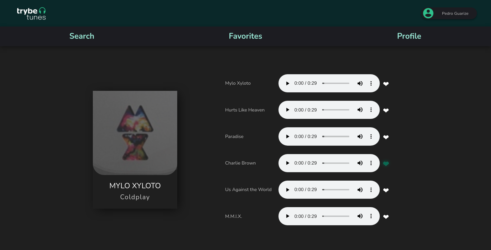

# React TrybeTunes
 

 

This was the third React project developed during Trybe's Front-End module.

In this project I created an application capable of playing music from a wide variety of bands and artists, creating a list of favorite songs and editing the logged in user's profile. This app is be able to:

* Log in;
* Search for a band or artist;
* List the available albums of that band or artist;
* Preview the songs in a selected album;
* Play a preview of the songs in this album;
* Favorite and Unfavorite songs;
* Viewing the list of favorite songs;
* View the profile of the logged in person;
* Edit the profile of the logged in person;

 

## Local setup and usage

* Clone this repo.
* Run `npm install`.
* Start the app with `npm start`.
